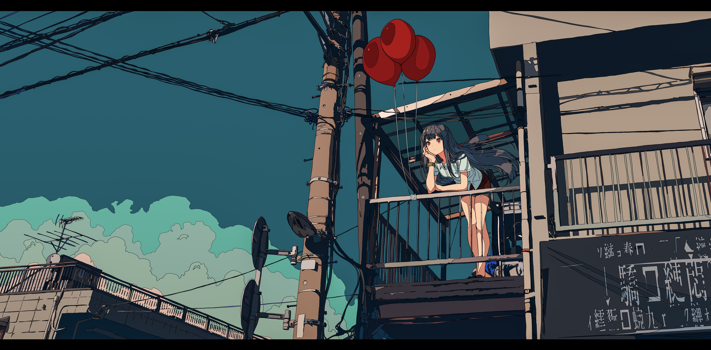
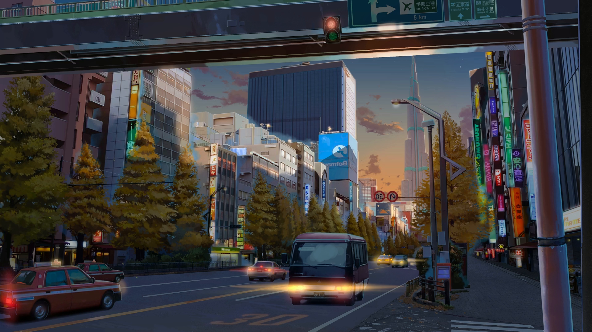
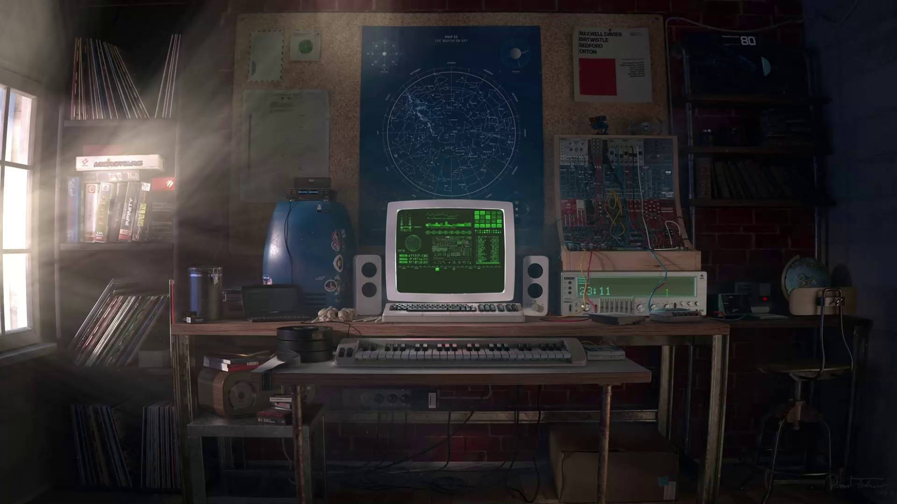

# Dotfiles

I mean, what should I say?

Here's make options:
- backgrounds
- base_wm (install alacritty, vim, nvim, bash and dunst config)
- all_home (backgrounds + base_wm)
- grub (requires root; installs grub themes and default.grub)

## Credits to [crambaud](https://github.com/crambaud) for base of userChrome.css
Also, here's tips on gettig userChrome to work:
- In the ```about:config``` page on your Firefox browser, set the following parameters to **True** :
  - ```toolkit.legacyUserProfileCustomizations.stylesheets```
  - ```layers.acceleration.force-enabled```
  - ```gfx.webrender.all```
  - ```svg.context-properties.content.enabled```
- Copy the userChrome.css file from this repository to your **chrome** folder. You can find the **chrome** folder here :
  - On Linux : ```$HOME/.mozilla/firefox/######.default-release/chrome/```
  - On Windows : ```C:\Users\[USERNAME]\AppData\Roaming\Mozilla\Firefox\Profiles\######.default-release\chrome\```
  - On MacOS : ```Users/[USERNAME]/Library/Application Support/Firefox/Profiles/######.default-release/chrome```
  - If it doesn't exist already create a folder called chrome

Here's the backgrounds:

**beach.jpg:**


**bebop.png:**


**c5jURGV.jpg:**



**caffe.jpg:**


**city-sunset.png:**



**computer.png:**



**night-city.jpg:**


**res-lights.jpg:**


**room.jpg:**


**sepia-city.jpg:**


**space_gruveye.png:**


**sushi.jpg:**


**tiny-room.jpg:**


**tokyo-city.jpg:**


**wallpapers.jpg:**


