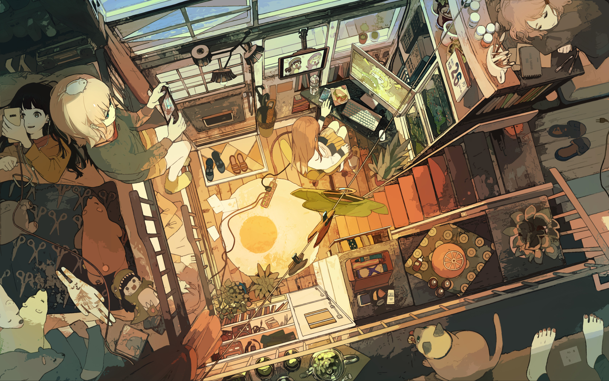
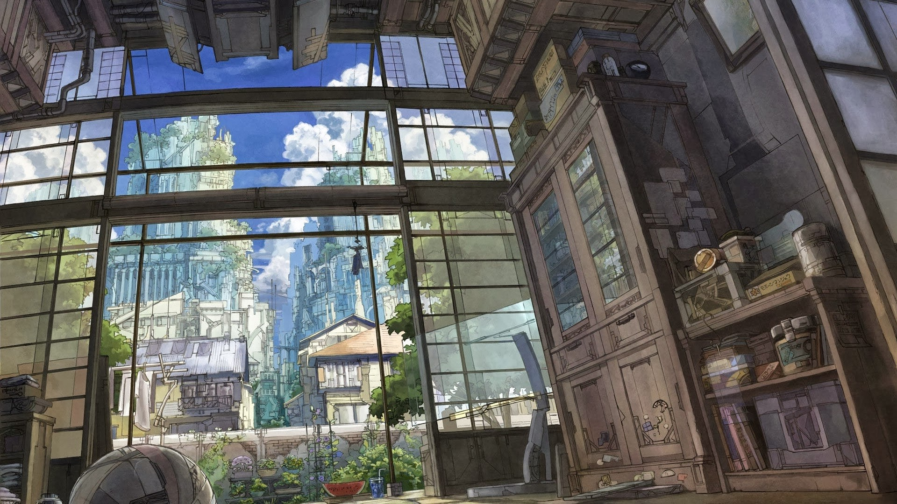

# Dotfiles

I mean, what should I say?

# Installation

## $HOME files

Check dotbot config for whatever you wish.

**Be careful, as it will delete old files**

> $ ./install

## Grub

> \# ./config-root.sh

Here's the backgrounds:

**balcony.jpg**

**beach.jpg**

**bebop.png**

**caffe.jpg**

**dorms.jpg**

**kakariko.jpg**

**mask.jpg**

**night-city.jpg**

**planet.jpg**

**res-lights.jpg**

**room.jpg**

**sepia-city.jpg**

**spaceart.jpg**

**street.jpg**

**sushi.jpg**

**terrace.jpg**

**tiny_room.jpg**

**tokyo-city.jpg**

**wallpapers.jpg**

