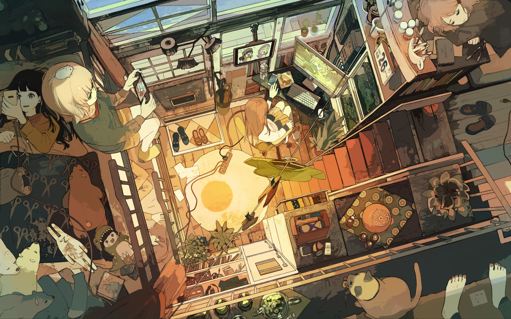
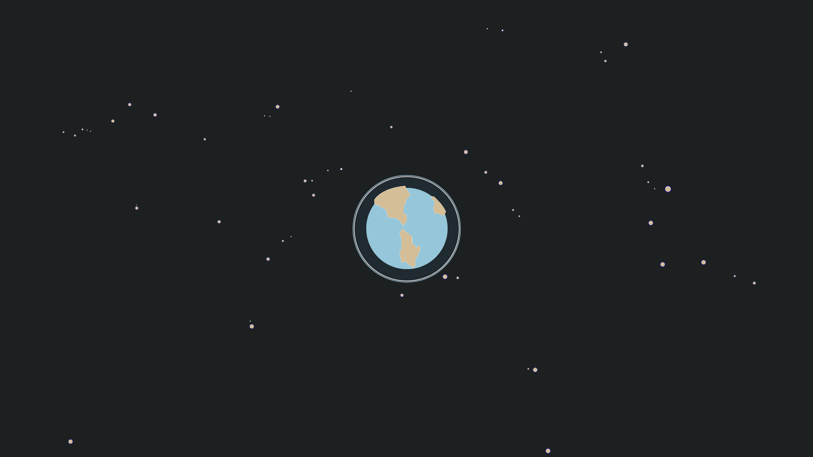
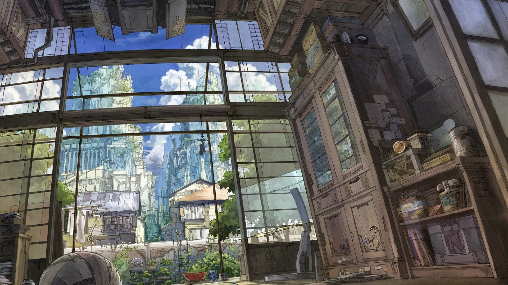
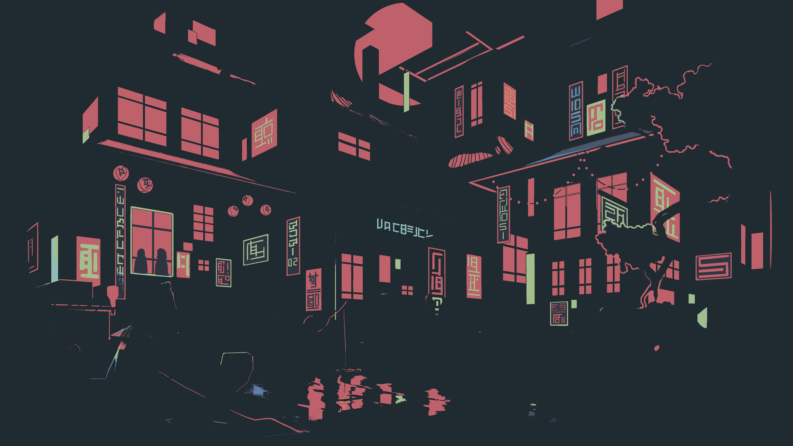

**accoustic_orange.jpg**

**airplane.png**

**alley.jpg**

**balcony.jpg**

**beach.jpg**

**bebop.png**

**bequem.jpg**

**caffe.jpg**

**city.jpg**

**city_girl.jpg**

**cyberpunk.jpg**

**dorms.jpg**

**kakariko.jpg**

**kitty.jpg**

**mafu_trad_wall.png**

**mask.jpg**

**mountains.png**

**neko_oni.png**

**night-city.jpg**

**planet.jpg**

**platform.jpg**

**poseidon.png**

**res-lights.jpg**

**room.jpg**

**sea.jpg**

**sepia.jpg**

**shrine.jpg**

**spaceart.jpg**

**statue.jpg**

**street.jpg**

**sushi.jpg**

**temple.png**

**terrace.jpg**

**tiny_room.jpg**

**tokyo-city.jpg**

**tokyo-night34.png**

**tree_of_life.jpg**

**wallpapers.jpg**

**yes.png**

